# AutoGrade+ Complete System Architecture & Codebase Guide

This document provides a **complete, file-by-file technical explanation** of every single file in the **AutoGrade+ Automated Grading System**. It explains the architecture, execution lifecycle, and technical implementation behind each component from database initialization to assignment creation, document parsing, RAG vector retrieval, multi-agent AI grading, and interactive lecturer review.

---

## 1. System Architecture Overview

```mermaid
graph TD
    subgraph Frontend ["Frontend (React 18 + Vite)"]
        UI_Context["AssignmentContext.jsx<br/>(Global State & Silent Polling)"]
        UI_API["api/client.js<br/>(Axios Client / API Wrapper)"]
        UI_Dash["Dashboard.jsx<br/>(Analytics & Overview)"]
        UI_Create["AssignmentCreator.jsx<br/>(Rubric & Tolerance Setup)"]
        UI_Upload["BulkUpload.jsx<br/>(Student Submissions Upload)"]
        UI_List["SubmissionsList.jsx<br/>(Batch Grading & Status Badges)"]
        UI_Review["GradingReview.jsx<br/>(Evidence Highlights & Override Audit)"]
        UI_Calib["Calibration.jsx<br/>(Anchor Benchmark Calibration)"]
        UI_Layout["Layout.jsx & Components<br/>(Sidebar, Workflow Banner, Modals)"]
    end

    subgraph Backend ["Backend (FastAPI + SQLAlchemy)"]
        API_Main["main.py<br/>(App Init, CORS, Self-Healing)"]
        DB_Layer["database.py & models.py<br/>(SQLite WAL Engine & ORM Tables)"]
        DB_Schemas["schemas.py<br/>(Pydantic Validation Models)"]
        
        subgraph Routes ["FastAPI Routers"]
            R_Assign["routes/assignments.py<br/>(Assignment & Calibration CRUD)"]
            R_Upload["routes/uploads.py<br/>(File Ingestion & Text Extract)"]
            R_Subs["routes/submissions.py<br/>(Grading Triggers, Batch Task, Overrides)"]
        end

        subgraph Core_Services ["Grading Engine & Supporting Services"]
            S_Grading["services/grading.py<br/>(Pipeline Orchestrator & State Machine)"]
            S_RAG["services/rag.py<br/>(Context Retrieval Wrapper)"]
            S_Embed["services/embedding.py<br/>(ChromaDB Persistent Vector Store)"]
            S_LLM["services/llm_service.py<br/>(Multi-Agent LLM & Mark Allocation)"]
            S_Doc["services/document_parser.py<br/>(PDF, DOCX, TXT Extractor)"]
            S_Conf["services/confidence.py<br/>(Deterministic Confidence Engine)"]
            S_CalImp["services/calibration_importer.py<br/>(Benchmark Dataset Importer)"]
            S_Excel["services/flexible_excel_parser.py<br/>(Excel Rubric Table Parser)"]
            S_ICC["services/icc_tracker.py<br/>(Inter-Rater Reliability / ICC)"]
            S_Store["services/storage.py<br/>(Local Disk & AWS S3 Sync)"]
        end
    end

    subgraph External ["External AI Services (via OpenRouter)"]
        LLM_Primary["Primary Grader<br/>(Google Gemini 3.1 Flash Lite)"]
        LLM_Auditor["Quality Auditor<br/>(Nemotron 120B / Claude)"]
    end

    %% Connections
    UI_Context --> UI_API --> API_Main --> Routes
    R_Assign --> DB_Layer
    R_Assign --> S_Embed
    R_Upload --> S_Doc --> DB_Layer
    R_Subs --> S_Grading
    S_Grading --> S_Doc
    S_Grading --> S_RAG --> S_Embed
    S_Grading --> S_LLM
    S_Grading --> S_Conf
    S_Grading --> S_ICC
    S_LLM --> LLM_Primary
    S_LLM --> LLM_Auditor
    S_Grading --> DB_Layer
    DB_Layer --> UI_Context
```

---

## 2. Backend Files Explanation

### Core Application & Database

#### 1. [`backend/app/main.py`](file:///Users/zoe/Downloads/Automated%20Grading/backend/app/main.py)
* **Purpose**: Application root entrypoint for the FastAPI framework.
* **Key Code Features**:
  * Configures unbuffered I/O (`sys.stdout.reconfigure(line_buffering=True)`) ensuring all server terminal logs output immediately.
  * Loads environment variables from [`backend/.env`](file:///Users/zoe/Downloads/Automated%20Grading/backend/.env).
  * **Startup Self-Healing**: On server boot, queries SQLite/PostgreSQL to check for submissions stuck in transient states (`processing`, `extracting_answers`, `retrieving_rubric`, `grading`). If found, automatically heals them back to `pending` or `graded` (if scores exist), preventing permanent lockouts after server restarts.
  * Sets up **CORS Middleware** allowing cross-origin requests from the React development server (`http://localhost:5173`).
  * Mounts static file directories for local file serving and registers routers: `assignments`, `submissions`, and `uploads`.
  * Installs `PollingAccessLogFilter` to suppress noisy 3-second background polling requests (`/submissions`, `/grading-status`) from spamming the developer terminal.

#### 2. [`backend/app/database.py`](file:///Users/zoe/Downloads/Automated%20Grading/backend/app/database.py)
* **Purpose**: Database engine connection lifecycle and SQLite concurrency manager.
* **Key Code Features**:
  * Tries connecting to PostgreSQL (`DATABASE_URL`). If not running, falls back automatically to local SQLite database ([`autograde_dev.db`](file:///Users/zoe/Downloads/Automated%20Grading/backend/autograde_dev.db)).
  * In SQLite mode, activates advanced PRAGMAs on every connection:
    * `PRAGMA journal_mode=WAL` (Write-Ahead Logging: enables concurrent readers and writers without blocking).
    * `PRAGMA synchronous=NORMAL` (reduces disk flush overhead).
    * `PRAGMA busy_timeout=30000` (waits up to 30 seconds for SQLite locks to clear during parallel batch grading, avoiding "database locked" errors).
  * Creates `SessionLocal` and defines the `get_db()` FastAPI dependency generator.

#### 3. [`backend/app/models.py`](file:///Users/zoe/Downloads/Automated%20Grading/backend/app/models.py)
* **Purpose**: SQLAlchemy ORM models defining database tables and entity relationships.
* **Key Tables**:
  * `Assignment`: Stores assignment title, course code, due date, status, total submissions, class average score, rubric JSON criteria, model answers, calibration toggles, and tolerance rate (default 0.10).
  * `Submission`: Stores student identity (`student_id`, `student_name`, `student_email`), file path, extracted `raw_text`, calculated `score`, `confidence_score`, `status` (`pending`, `processing`, `graded`, `flagged`), structured `feedback` breakdown, and quote `highlights`.
  * `CalibrationSet` & `CalibrationExample`: Stores examiner-graded anchor papers across High, Borderline, and Low bands used for few-shot in-context learning.
  * `AuditLog`: Immutable audit trail storing lecturer overrides (`old_score`, `new_score`, `comment`, timestamp).
  * `EvaluationLog`: Scientific evaluation logs tracking latency, token costs, prompt version, confidence, and AI vs lecturer score deltas.

#### 4. [`backend/app/schemas.py`](file:///Users/zoe/Downloads/Automated%20Grading/backend/app/schemas.py)
* **Purpose**: Pydantic schemas validating API request payloads and serializing API responses.
* **Key Schemas**:
  * `AssignmentCreate` / `AssignmentResponse`: Enforces rubric criteria array, model answers, and tolerance settings.
  * `SubmissionResponse`: Dictates the JSON structure returned to frontend (scores, confidence, feedback breakdown, text highlights).
  * `ScoreOverrideRequest`: Validates manual score adjustment submissions from lecturers.
  * `CalibrationExampleCreate` / `CalibrationExampleResponse`: Validates benchmark few-shot exemplars.

---

### Backend API Routers

#### 5. [`backend/app/routes/assignments.py`](file:///Users/zoe/Downloads/Automated%20Grading/backend/app/routes/assignments.py)
* **Purpose**: REST controller for creating, updating, listing, and exporting assignments.
* **Key Endpoints**:
  * `POST /api/assignments`: Creates an assignment, parses rubric JSON, and triggers ChromaDB vector indexing.
  * `GET /api/assignments`: Returns assignments with live aggregated statistics (submission count, class average).
  * `GET /api/assignments/{id}`: Returns assignment detail including parsed rubric criteria.
  * `PUT /api/assignments/{id}`: Updates calibration parameters and tolerance rate.
  * `DELETE /api/assignments/{id}`: Cascades deletion of assignment and associated submissions.
  * `GET /api/assignments/{id}/export-csv`: Streams a formatted grade spreadsheet (Student ID, Name, Score, Confidence, Status) for LMS export.
  * `POST /api/assignments/{id}/calibrate`: Triggers examiner calibration workflow.

#### 6. [`backend/app/routes/submissions.py`](file:///Users/zoe/Downloads/Automated%20Grading/backend/app/routes/submissions.py)
* **Purpose**: REST controller for student submissions, grading execution, and lecturer overrides.
* **Key Code Features**:
  * `heal_orphaned_submissions()`: Synchronizes submission statuses against real database values before serving requests.
  * `GET /api/assignments/{id}/submissions`: Retrieves all submissions for an assignment.
  * `GET /api/submissions/{id}`: Fetches detailed submission breakdown, highlights, and audit history.
  * `POST /api/submissions/{id}/grade`: Triggers single-submission AI grading synchronously.
  * `POST /api/assignments/{id}/grade-all`: Spawns asynchronous `BackgroundTasks` running `_batch_grade_task()`.
  * `_batch_grade_task()`: Iterates over all pending submissions one-by-one, marks them `processing`, executes `run_grading_pipeline()`, and updates class statistics upon completion.
  * `GET /api/assignments/{id}/grading-status`: Returns real-time batch progress (`is_grading`, `completed_count`, `total_count`).
  * `PATCH /api/submissions/{id}/override`: Records lecturer grade adjustments, clears audit flags, writes to `AuditLog`, and recalibrates assignment average score.

#### 7. [`backend/app/routes/uploads.py`](file:///Users/zoe/Downloads/Automated%20Grading/backend/app/routes/uploads.py)
* **Purpose**: Ingestion controller for student submissions (ZIP archives or individual files).
* **Key Code Features**:
  * Handles multipart file uploads (PDF, DOCX, TXT).
  * If a `.zip` archive is uploaded, safely decompresses it into a temporary workspace.
  * Calls `document_parser.py` to extract text from each student file.
  * Employs regex extractors to identify student matriculation IDs (e.g. `32838662`) and names from filenames or document headers.
  * Saves files locally (or to AWS S3 via `storage.py`), creates `Submission` records with `status='pending'`, and pre-populates `raw_text`.

---

### Backend Services & Grading Engine

#### 8. [`backend/app/services/grading.py`](file:///Users/zoe/Downloads/Automated%20Grading/backend/app/services/grading.py)
* **Purpose**: The master grading pipeline orchestrator executing `run_grading_pipeline()`.
* **The 7-Step Pipeline**:
  1. **Text Extraction**: Sets status to `extracting_answers`. Retrieves `raw_text` or calls `extract_text_from_file()`.
  2. **Blank Submission Fast-Path**: Calls `is_blank_submission()`. If student provided no answer or only `"-"` / `"N/A"`, immediately awards `0.0` marks without making LLM API calls, logs 100% confidence, and returns in <0.05s.
  3. **RAG Vector Retrieval**: Sets status to `retrieving_rubric`. Queries ChromaDB via `rag.py` to retrieve the most relevant rubric clauses and model answers.
  4. **Few-Shot Anchor Matching**: Queries `CalibrationExample` table for examiner-graded benchmarks matching the assignment's questions.
  5. **Multi-Agent Evaluation**: Sets status to `grading`. Calls `call_llm_for_grading()` in `llm_service.py`.
  6. **Reconciliation & Tolerance Check**: Compares Primary Grader vs Auditor scores against `tolerance_rate`. If discrepancy exceeds tolerance, sets status to `flagged`.
  7. **Persistence & Evaluation Logging**: Saves scores, question-by-question breakdown, and highlights into the database, then logs latency, cost, and model metadata to `EvaluationLog`.

#### 9. [`backend/app/services/llm_service.py`](file:///Users/zoe/Downloads/Automated%20Grading/backend/app/services/llm_service.py)
* **Purpose**: Multi-Agent LLM service interfacing with OpenRouter API.
* **Core Components**:
  * **Agent 1: Rubric Context Parser** (`call_rubric_context_parser_agent`): Standardizes freeform rubric text into structured per-question JSON schema objects.
  * **Agent 2: Primary Grader** (`call_primary_grading_agent`): Uses `google/gemini-3.1-flash-lite` to evaluate student responses with Chain-of-Thought (CoT) reasoning and extracts exact quote substrings (`highlights`).
  * **Agent 3: Quality Auditor** (`call_auditor_verification_agent`): Uses `nvidia/nemotron-3-super-120b-a12b` or `claude` to independently audit grading rigor, checking for leniency or missed derivation steps.
  * **Multi-Agent Reconciliation** (`call_llm_for_grading`): Compares scores against tolerance threshold and reconciles final feedback.
  * **Hamilton / Largest Remainder Mark Allocation Algorithm**: Re-balances highlight badges into clean integer (`+1m`, `+2m`) or half-mark (`+0.5m`) units, eliminating nonsensical decimals like `0.9m` or `5.1m`.

#### 10. [`backend/app/services/rag.py`](file:///Users/zoe/Downloads/Automated%20Grading/backend/app/services/rag.py)
* **Purpose**: RAG context retrieval interface for the grading engine.
* **Key Function**:
  * `retrieve_rubric_context(assignment_id, student_text, top_k=4)`: Calls `embedding_service` to query ChromaDB for the top-4 most semantically similar rubric criteria and model answer chunks matching the student's text, removes internal IDs, and formats a clean context prompt for the LLM.

#### 11. [`backend/app/services/embedding.py`](file:///Users/zoe/Downloads/Automated%20Grading/backend/app/services/embedding.py)
* **Purpose**: ChromaDB persistent vector database service (`EmbeddingService`).
* **Key Code Features**:
  * Manages ChromaDB client under directory `backend/chroma_db`.
  * `index_assignment_reference()`: Chunks and embeds question prompts, rubric criteria, and reference answers into vector collections named `assignment_{id}`.
  * `query_reference_context()`: Performs vector cosine similarity queries against student text to find matching question criteria.

#### 12. [`backend/app/services/confidence.py`](file:///Users/zoe/Downloads/Automated%20Grading/backend/app/services/confidence.py)
* **Purpose**: Deterministic confidence scoring and audit discrepancy decision engine.
* **Key Functions**:
  * `evaluate_discrepancy(primary_score, auditor_score, max_score, tolerance_rate)`: Computes $D_i = \min(\text{tolerance} \times \text{max\_score}, \text{cap})$. If $|P - A| > D_i$, flags a conflict.
  * `evaluate_confidence_and_status()`: Computes an objective confidence score ($0.0$ to $1.0$) based on model agreement, rubric coverage, and answer clarity.

#### 13. [`backend/app/services/document_parser.py`](file:///Users/zoe/Downloads/Automated%20Grading/backend/app/services/document_parser.py)
* **Purpose**: Multi-format document parser.
* **Key Code Features**:
  * `extract_text_from_file()`: Dispatches parsing to `_extract_pdf()` (using `pypdf`), `_extract_docx()` (using `python-docx`), `_extract_excel()`, or text readers.
  * `calculate_question_max_mark()`: Regex parser that detects question max marks from prompt text headers (e.g. `(Total: 10 marks)`, `(5 marks each)`).

#### 14. [`backend/app/services/calibration_importer.py`](file:///Users/zoe/Downloads/Automated%20Grading/backend/app/services/calibration_importer.py)
* **Purpose**: Calibration dataset importer for few-shot benchmark exemplars.
* **Key Code Features**:
  * Reads Excel/CSV benchmark datasets (e.g. `Dataset for prompt.xlsx`).
  * Normalizes column aliases (`student_id`, `student_text`, `examiner_score`, `max_score`).
  * Creates `CalibrationSet` and `CalibrationExample` records categorized by anchor type (`high`, `borderline`, `low`).

#### 15. [`backend/app/services/flexible_excel_parser.py`](file:///Users/zoe/Downloads/Automated%20Grading/backend/app/services/flexible_excel_parser.py)
* **Purpose**: Resilient parser for diverse and irregularly formatted Excel rubric sheets.
* **Key Code Features**:
  * Automatically detects header rows, merged cells, and question-boundary splits.
  * Converts unstructured table rows into clean rubric item dictionaries.

#### 16. [`backend/app/services/icc_tracker.py`](file:///Users/zoe/Downloads/Automated%20Grading/backend/app/services/icc_tracker.py)
* **Purpose**: Scientific validation tracker calculating Intraclass Correlation Coefficient (ICC).
* **Key Code Features**:
  * Loads benchmark dataset `Dataset for prompt.xlsx`.
  * Computes inter-rater reliability metrics (ICC(2,1) two-way random single rater, Mean Absolute Error, Pearson $r$) comparing Human Examiner vs AI Grader scores.
  * Logs comparison data to `evaluation/backend_score_comparison.csv` and `evaluation/backend_icc_results.csv`.

#### 17. [`backend/app/services/storage.py`](file:///Users/zoe/Downloads/Automated%20Grading/backend/app/services/storage.py)
* **Purpose**: Hybrid file storage manager (`StorageService`).
* **Key Code Features**:
  * Manages local file uploads in `backend/uploads/`.
  * If AWS credentials exist in `.env`, automatically syncs uploaded papers to an Amazon S3 bucket.

#### 18. [`backend/.env`](file:///Users/zoe/Downloads/Automated%20Grading/backend/.env)
* **Purpose**: Environment configuration defining API keys (`OPENROUTER_API_KEY`), model selection (`LLM_MODEL=google/gemini-3.1-flash-lite`, `AUDITOR_MODEL=nvidia/nemotron-3-super-120b-a12b`), and database URLs.

---

## 3. Frontend Files Explanation

### Root & Global State

#### 19. [`frontend/src/main.jsx`](file:///Users/zoe/Downloads/Automated%20Grading/frontend/src/main.jsx)
* **Purpose**: Client application entrypoint. Mounts the root React DOM node with `React.StrictMode` and `BrowserRouter`.

#### 20. [`frontend/src/App.jsx`](file:///Users/zoe/Downloads/Automated%20Grading/frontend/src/App.jsx)
* **Purpose**: Central routing table. Sets up routes (`/`, `/create`, `/upload`, `/submissions`, `/review`, `/calibration`) wrapped inside `AssignmentProvider` and `Layout`.

#### 21. [`frontend/src/api/client.js`](file:///Users/zoe/Downloads/Automated%20Grading/frontend/src/api/client.js)
* **Purpose**: Unified HTTP client connecting React to FastAPI endpoints.
* **Key Functions**:
  * `fetchAssignments()`, `createAssignment()`, `updateAssignment()`, `deleteAssignment()`.
  * `fetchSubmissions()`, `fetchSubmissionDetail()`, `gradeSubmission()`, `gradeAllSubmissions()`, `overrideScore()`.
  * `downloadGradesCSV()`: Handles binary blob downloading for grade exports.

#### 22. [`frontend/src/context/AssignmentContext.jsx`](file:///Users/zoe/Downloads/Automated%20Grading/frontend/src/context/AssignmentContext.jsx)
* **Purpose**: Central React Context Provider managing global state.
* **Key Code Features**:
  * Maintains `assignments`, `currentAssignmentId`, `submissions`, `activeSubmission`, and `isGradingActive`.
  * **Silent Background Polling**: Polls every 3 seconds while grading is active. Incorporates deep difference checking before calling `setSubmissions()`, preventing redundant re-render cascades.
  * Exposes global action functions: `triggerGradeSubmission`, `triggerGradeAll`, `handleScoreOverride`, `loadSubmissions`.

---

### Frontend Pages

#### 23. [`frontend/src/pages/Dashboard.jsx`](file:///Users/zoe/Downloads/Automated%20Grading/frontend/src/pages/Dashboard.jsx)
* **Purpose**: Lecturer overview analytics dashboard.
* **Key Features**:
  * Metrics cards: Total Submissions, Class Average Score, Flagged Audit Rate, Active Grading Status.
  * Score distribution bar chart and quick navigation cards to upload papers or review flags.

#### 24. [`frontend/src/pages/AssignmentCreator.jsx`](file:///Users/zoe/Downloads/Automated%20Grading/frontend/src/pages/AssignmentCreator.jsx)
* **Purpose**: Assignment and rubric creation interface.
* **Key Features**:
  * Form fields for Course Code, Title, Due Date, and Tolerance Rate slider.
  * Multi-format rubric uploader (PDF/DOCX/Excel) with live question/mark preview.

#### 25. [`frontend/src/pages/BulkUpload.jsx`](file:///Users/zoe/Downloads/Automated%20Grading/frontend/src/pages/BulkUpload.jsx)
* **Purpose**: Document ingestion portal.
* **Key Features**:
  * Drag-and-drop file upload supporting ZIP archives or multiple PDF/DOCX files.
  * Upload progress tracking and direct routing to Submissions List upon completion.

#### 26. [`frontend/src/pages/SubmissionsList.jsx`](file:///Users/zoe/Downloads/Automated%20Grading/frontend/src/pages/SubmissionsList.jsx)
* **Purpose**: Submissions management table.
* **Key Features**:
  * Table listing all student submissions with status badges (`Graded & Approved`, `⚠️ Flagged for Audit`, `⌛ Pending`, `AI Grading in Progress`).
  * "Grade All Submissions" batch button and per-paper "Grade with AI" buttons.
  * Quick links to open any submission in `GradingReview`.

#### 27. [`frontend/src/pages/GradingReview.jsx`](file:///Users/zoe/Downloads/Automated%20Grading/frontend/src/pages/GradingReview.jsx)
* **Purpose**: The primary evaluation and lecturer audit interface.
* **Key Features**:
  * **Two-Column Split Layout**:
    * **Left Column**: Student's raw submitted response with interactive color-coded text highlights. Clicking any highlight opens a popup showing the exact rubric reasoning and mark delta.
    * **Right Column**: Per-question score steppers, unified AI reasoning card, expandable feedback, and lecturer override form.
  * **Frozen Header**: Quick switcher (`Prev` / `Next`) to navigate between students without leaving the screen, along with an "Approve & Clear Flag" button.
  * **60 FPS High-Performance**: Uses immutable singletons (`EMPTY_ARRAY`, `EMPTY_OBJECT`) and diff-guarded state setters, completely eliminating lag and render loops on pending/in-progress submissions.

#### 28. [`frontend/src/pages/Calibration.jsx`](file:///Users/zoe/Downloads/Automated%20Grading/frontend/src/pages/Calibration.jsx)
* **Purpose**: Benchmark calibration portal for lecturers.
* **Key Features**:
  * Allows lecturers to mark 3–5 representative sample papers across High, Borderline, and Low bands.
  * Injects examiner benchmark decisions directly into the AI's few-shot grading context.

---

### Frontend UI Components & Styles

#### 29. [`frontend/src/components/Layout.jsx`](file:///Users/zoe/Downloads/Automated%20Grading/frontend/src/components/Layout.jsx)
* **Purpose**: Main application shell with collapsible navigation sidebar, current assignment switcher dropdown, and header.

#### 30. [`frontend/src/components/WorkflowBanner.jsx`](file:///Users/zoe/Downloads/Automated%20Grading/frontend/src/components/WorkflowBanner.jsx)
* **Purpose**: Visual step-by-step progress banner guiding lecturers through the workflow: Create Assignment $\rightarrow$ Upload Papers $\rightarrow$ Grade $\rightarrow$ Review & Audit.

#### 31. [`frontend/src/components/VectorStoreModal.jsx`](file:///Users/zoe/Downloads/Automated%20Grading/frontend/src/components/VectorStoreModal.jsx)
* **Purpose**: Modal inspector allowing lecturers to view indexed ChromaDB vector embeddings and rubric chunks.

#### 32. [`frontend/src/components/HelpSidebar.jsx`](file:///Users/zoe/Downloads/Automated%20Grading/frontend/src/components/HelpSidebar.jsx)
* **Purpose**: Slide-over help guide explaining platform concepts, tolerance rates, and audit flags.

#### 33. [`frontend/src/components/GradingProgressBar.jsx`](file:///Users/zoe/Downloads/Automated%20Grading/frontend/src/components/GradingProgressBar.jsx)
* **Purpose**: Real-time batch progress indicator showing percentage completion and active paper counts.

#### 34. [`frontend/src/components/ErrorBoundary.jsx`](file:///Users/zoe/Downloads/Automated%20Grading/frontend/src/components/ErrorBoundary.jsx)
* **Purpose**: React error boundary component catching runtime exceptions and offering clean recovery.

#### 35. Stylesheets
* [`frontend/src/index.css`](file:///Users/zoe/Downloads/Automated%20Grading/frontend/src/index.css): Core design tokens, CSS variables, and reset rules.
* [`frontend/src/App.css`](file:///Users/zoe/Downloads/Automated%20Grading/frontend/src/App.css): Layout container rules.
* [`frontend/src/components/Layout.css`](file:///Users/zoe/Downloads/Automated%20Grading/frontend/src/components/Layout.css): Sidebar and navigation styles.
* [`frontend/src/pages/Dashboard.css`](file:///Users/zoe/Downloads/Automated%20Grading/frontend/src/pages/Dashboard.css): Dashboard card and grid styles.

---

## 4. Evaluation Suite (Research & Benchmarking)

* [`evaluation/run_experiment_2_audit.py`](file:///Users/zoe/Downloads/Automated%20Grading/evaluation/run_experiment_2_audit.py): Multi-model benchmarking script running automated trials comparing Primary Graders against Auditor models.
* [`evaluation/compare_three_tests.py`](file:///Users/zoe/Downloads/Automated%20Grading/evaluation/compare_three_tests.py): Compares grading performance across Baseline, Tolerance, and Calibration setups.
* [`evaluation/evaluate_few_shot_calibration.py`](file:///Users/zoe/Downloads/Automated%20Grading/evaluation/evaluate_few_shot_calibration.py): Computes statistical ICC, MAE, and Pearson $r$ metrics on examiner datasets.

---

## 5. End-to-End File Interaction Lifecycle

| Step | Action / Event | Primary Files Involved | Data Flow Description |
| :--- | :--- | :--- | :--- |
| **1** | System Initialization | `main.py`, `database.py`, `models.py` | Sets SQLite WAL mode, builds tables, self-heals orphaned jobs. |
| **2** | Create Assignment | `AssignmentCreator.jsx`, `routes/assignments.py`, `embedding.py` | Rubric uploaded $\rightarrow$ parsed to JSON $\rightarrow$ embedded into ChromaDB collection. |
| **3** | Upload Submissions | `BulkUpload.jsx`, `routes/uploads.py`, `document_parser.py` | Papers uploaded $\rightarrow$ text extracted $\rightarrow$ stored in `submissions` as `pending`. |
| **4** | Benchmark Calibration | `Calibration.jsx`, `routes/assignments.py`, `calibration_importer.py` | Lecturer grades 3-5 anchors (or imports Excel) $\rightarrow$ stored in `calibration_sets` & `calibration_examples`. |
| **5** | Initiate Grading | `SubmissionsList.jsx`, `routes/submissions.py` | User triggers batch/single grade $\rightarrow$ `_batch_grade_task()` background task spawns. |
| **6** | Orchestration, RAG & Few-Shot Assembly | `services/grading.py`, `services/rag.py`, `services/embedding.py` | Checks blank response $\rightarrow$ queries ChromaDB $\rightarrow$ pulls question-matched calibration anchors. |
| **7** | Multi-Agent LLM Call | `services/llm_service.py` | Gemini 3.1 evaluates with few-shot anchors $\rightarrow$ Nemotron audits score $\rightarrow$ Hamilton badges aligned. |
| **8** | Decision & Quality Control | `services/confidence.py`, `models.py` | Compares model agreement $\rightarrow$ flags paper if discrepancy exceeds tolerance rate. |
| **9** | Persistence & Reliability Tracking | `models.py`, `evaluation_logs`, `services/icc_tracker.py` | Writes score & highlights $\rightarrow$ logs technical provenance $\rightarrow$ computes ICC reliability. |
| **10** | Lecturer Review & Override | `GradingReview.jsx`, `routes/submissions.py` | Lecturer reviews highlights $\rightarrow$ adjusts marks $\rightarrow$ written to `AuditLog`. |

