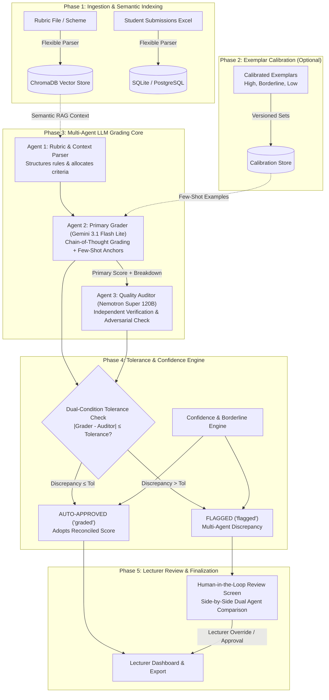

# AutoGrade+ Complete Pipeline Workflow & System Architecture

This document provides a comprehensive, end-to-end breakdown of the **AutoGrade+ Automated Grading Pipeline**. It details how raw rubrics and student submissions flow through the ingestion, semantic retrieval, multi-agent evaluation, tolerance reconciliation, and human-in-the-loop review layers.

---

## 1. High-Level Architecture Overview

AutoGrade+ combines **Few-Shot Exemplar Calibration** with a **Multi-Agent Quality-Control & Auditor Reconciliation Architecture**:



---

## 2. Detailed Phase-by-Phase Workflow

### Phase 1: Ingestion & Knowledge Indexing
1. **Rubric Parsing & Schema Resolution**:
   - The lecturer uploads a marking scheme (`.xlsx`, `.csv`, `.pdf`, `.docx`).
   - The `FlexibleExcelParser` identifies column headers using semantic aliases (`question_no`, `question`, `model_answer`, `max_mark`).
2. **ChromaDB Semantic Indexing**:
   - Questions and criterion-level guidelines are transformed into vector embeddings using `all-MiniLM-L6-v2`.
   - Each criterion is indexed with metadata (`assignment_id`, `question_number`, `max_score`) enabling precise RAG semantic search during grading.
3. **Submissions Upload & Storage**:
   - The class response file is uploaded.
   - Columns are auto-detected (`Student ID`, `Student Name`, `Question Number`, `Response Text`).
   - Submissions are persisted in the database with status `pending`.

---

### Phase 2: Few-Shot Calibration Grounding (Optional)
Calibration eliminates subjective prompt bias by anchoring the AI to the lecturer's exact scoring standards.
- **Method A (Studio Grading)**: The lecturer marks 1–3 designated sample papers directly in the web UI.
- **Method B (Spreadsheet Import)**: The lecturer uploads past human-graded responses. The scanner extracts student responses, marks, and examiner feedback.
- **Anchor Categorization**:
  - **High Anchor** (Full marks: 9–10/10): Teaches the model what comprehensive mastery looks like.
  - **Borderline Anchor** (Partial marks: 5–6/10): Teaches the model where mark deductions begin.
  - **Low Anchor** (Misconception: 1–3/10): Teaches the model to identify fundamental errors.
- **Storage**: Exemplars are saved with question keys and auto-incrementing calibration set versions (`version + 1`).

---

### Phase 3: The Multi-Agent Grading Core (Per Paper Execution)

For every student submission in the batch queue, the system executes 4 distinct stages:

```
[Submission Pipeline Flow]
 ├─ [1/4] Text Extraction & Normalization
 ├─ [2/4] Semantic RAG Context Retrieval (ChromaDB)
 ├─ [3/4] Multi-Agent LLM Orchestration
 │   ├─ Agent 1: Rubric Parser
 │   ├─ Agent 2: Primary Grader (with Few-Shot Exemplars)
 │   └─ Agent 3: Quality Auditor
 └─ [4/4] Confidence Check & Tolerance Reconciliation
```

#### Step 1: Text Extraction & Normalization
- Extracts student answer text for all questions in the paper.
- Cleans whitespace, encoding anomalies, and detects empty submissions.

#### Step 2: Semantic RAG Retrieval
- Queries ChromaDB using the student's text to pull relevant rubric criteria, model answers, and penalization guidelines.

#### Step 3: Agent 1 — Rubric & Context Parser Agent
- **Role**: Structures unstructured rubric text into a formal JSON rule schema.
- **Output**: Criterion breakdown, maximum marks per question, and specific deduction thresholds.

#### Step 4: Agent 2 — Primary Grader Agent (`google/gemini-3.1-flash-lite`)
- **Role**: Evaluates the student's work using Chain-of-Thought (CoT) reasoning.
- **Grounding**: Injects question-matched few-shot exemplars (from Phase 2).
- **Output**:
  - `overall_score`: Total points awarded.
  - `breakdown`: Question-by-question marks and detailed feedback.
  - `highlights`: Specific phrases in the student's text indicating strong points or errors.

#### Step 5: Agent 3 — Quality Auditor Agent (`nvidia/nemotron-3-super-120b-a12b`)
- **Role**: Independent second marker and adversarial auditor.
- **Process**:
  - Takes student text, rubric, and **Agent 2's awarded score**.
  - Checks if Agent 2 was too lenient, too harsh, or missed rubric criteria.
  - Independently calculates an `auditor_score` and discrepancy delta ($\Delta$).
  - Proposes a recommendation: `AGREEMENT`, `ADOPT_AUDITOR`, or `DISAGREEMENT`.

---

### Phase 4: Confidence & Tolerance Reconciliation Engine

The system reconciles the two AI markers using deterministic mathematical guardrails:

#### 1. Dual-Condition Discrepancy Formula
$$\Delta = |Score_{\text{Primary}} - Score_{\text{Auditor}}|$$
$$\text{Allowed Discrepancy} = \text{Tolerance Rate} \times \text{Max Mark}$$

| Tolerance Setting | Permitted Gap (on 10-pt Q) | System Action if $\Delta \le \text{Tolerance}$ | System Action if $\Delta > \text{Tolerance}$ |
| :---: | :---: | :--- | :--- |
| **0% (Strict)** | $0.0\text{ marks}$ | Reconcile & Auto-Approve | **FLAGGED** for Lecturer Review |
| **5% (Conservative)** | $0.5\text{ marks}$ | Reconcile & Auto-Approve | **FLAGGED** for Lecturer Review |
| **10% (Balanced — Default)** | $1.0\text{ mark}$ | Reconcile & Auto-Approve | **FLAGGED** for Lecturer Review |
| **15% (Lenient)** | $1.5\text{ marks}$ | Reconcile & Auto-Approve | **FLAGGED** for Lecturer Review |

#### 2. Automatic Flagging Triggers
A paper is immediately tagged as `flagged` (requiring human review) if ANY of the following occur:
1. **Multi-Agent Auditor Discrepancy**: $\Delta > \text{Tolerance}$.
2. **Borderline Pass/Fail Threshold**: Overall score is within $\pm 0.5$ marks of the passing mark (e.g. 49.5–50.5%).
3. **Low Confidence Score**: Composite confidence $< 0.70$ (70%).
4. **Empty or Irrelevant Response**: Student provided blank answer or gibberish.
5. **Operational Random QC Audit**: Optional background audit sample (e.g. 5% random check).

#### 3. Auditor-Based Reconciliation
If $\Delta \le \text{Tolerance}$, the submission is marked `graded` (Auto-Approved). The system adopts the Auditor-reconciled score to ensure rigorous grading.

#### 4. Real-Time Statistical Reliability Tracking
- Every graded paper is automatically compared against historical benchmarks in [`evaluation/backend_score_comparison.csv`](file:///Users/zoe/Downloads/Automated%20Grading/evaluation/backend_score_comparison.csv).
- Calculates the two-way random absolute agreement **Intraclass Correlation Coefficient ($ICC(A,1)$)** in real-time.

---

### Phase 5: Lecturer Review & Finalization (Human-in-the-Loop)

1. **Submissions List UI**:
   - Filter papers by `All`, `Graded (Auto-Approved)`, `Flagged (Needs Review)`, or `Ungraded`.
   - Real-time progress bar tracking batch grading completion.
2. **Review & Grading Studio**:
   - Inspect student response with side-by-side rubric criteria.
   - View **Dual-Agent Comparison Card**: Shows Grader Score vs. Auditor Score and exact discrepancy notes.
   - One-click lecturer override: Lecturer can adjust scores and comments, which are tracked in the database audit log.
3. **Export & LMS Integration**:
   - One-click CSV export with student IDs, raw scores, percentage marks, breakdown by question, and audit flags.

---

## 3. Terminal Log Output Reference

When running `npm run backend:dev`, your terminal displays the exact step of the pipeline in real-time:

```text
===========================================================================
 [AI BATCH GRADING INITIATED] Assignment ID: assign-2f622c
 [Queue] 10 submission(s) queued for evaluation
===========================================================================

┌─────────────────────────────────────────────────────────────────────────┐
│ [QUEUE PROGRESS] Paper 1/10 (0% Completed)
│ Student: Student 31107834 (ID: 31107834)
└─────────────────────────────────────────────────────────────────────────┘

[Submission 31107834] (Student 31107834)
 ├─ [1/4] Extracting student submission text...
 ├─ [2/4] Retrieving ChromaDB rubric & question vector context...
 ├─ [3/4] Running Multi-Agent LLM (FEW_SHOT mode, 3 exemplars via google/gemini-3.1-flash-lite)...
 │   ├─ [Agent 1: Rubric Parser] Structuring rubric rules & RAG context...
 │   │  └─ Loaded 2 rubric rule(s) & reference guidelines.
 │   ├─ [Agent 2: Primary Grader (google/gemini-3.1-flash-lite)] Evaluating submission in Few-Shot mode...
 │   │  └─ Primary Score Awarded: 11.0/20.0
 │   ├─ [Agent 3: Quality Auditor (nvidia/nemotron-3-super-120b-a12b)] Performing independent verification...
 │   │  ├─ Auditor Score: 11.5/20.0 | Discrepancy: 0.5 pts (MINOR)
 │   │  └─ Auditor Action: ADOPT_AUDITOR (Audit Passed: True)
 │   ├─ [Engine: Confidence & Reconciliation] Computing calibrated confidence (Tolerance: 10%)...
 │   └─ [Reconciliation Complete] Final Status: GRADED | Final Score: 11.5/20.0 | Confidence: 88.5%
 ├─ [4/4] Confidence check (88.5%) & Multi-Agent Reconciliation...
[ICC Tracker] Calculated ICC score successfully -> /Users/zoe/Downloads/Automated Grading/evaluation/backend_icc_results.csv
 └─ Status: GRADED | Score: 11.5/20.0 | Confidence: 88.5% | Completed in 14.2s
```

---

## 4. Key Component & File Map

| Component | Key Files in Repository | Responsibility |
| :--- | :--- | :--- |
| **Ingestion & Parsers** | [`flexible_excel_parser.py`](file:///Users/zoe/Downloads/Automated%20Grading/backend/app/services/flexible_excel_parser.py)<br>[`calibration_importer.py`](file:///Users/zoe/Downloads/Automated%20Grading/backend/app/services/calibration_importer.py) | Scans headers flexibly for rubrics, student papers, and calibration spreadsheets. |
| **Vector Store (RAG)** | [`rag_service.py`](file:///Users/zoe/Downloads/Automated%20Grading/backend/app/services/rag_service.py) | ChromaDB vector indexing and similarity retrieval. |
| **Multi-Agent LLMs** | [`llm_service.py`](file:///Users/zoe/Downloads/Automated%20Grading/backend/app/services/llm_service.py) | Orchestrates Agent 1 (Parser), Agent 2 (Primary Grader), and Agent 3 (Auditor). |
| **Grading Pipeline** | [`grading.py`](file:///Users/zoe/Downloads/Automated%20Grading/backend/app/services/grading.py) | Background worker queue, submission tracking, database persistence. |
| **Decision & Tolerance** | [`confidence.py`](file:///Users/zoe/Downloads/Automated%20Grading/backend/app/services/confidence.py) | Discrepancy checking, tolerance thresholds, borderline tagging, auto-approval. |
| **Statistical Evaluation** | [`evaluate_few_shot_calibration.py`](file:///Users/zoe/Downloads/Automated%20Grading/evaluation/evaluate_few_shot_calibration.py)<br>[`run_experiment_2_audit.py`](file:///Users/zoe/Downloads/Automated%20Grading/evaluation/run_experiment_2_audit.py) | ICC reliability benchmarking, MAE, scoring bias, and empirical sweep analysis. |
| **Web UI** | [`Calibration.jsx`](file:///Users/zoe/Downloads/Automated%20Grading/frontend/src/pages/Calibration.jsx)<br>[`SubmissionsList.jsx`](file:///Users/zoe/Downloads/Automated%20Grading/frontend/src/pages/SubmissionsList.jsx)<br>[`GradingReview.jsx`](file:///Users/zoe/Downloads/Automated%20Grading/frontend/src/pages/GradingReview.jsx) | React frontend for calibration setup, tolerance tuning, progress monitoring, and grading review. |
